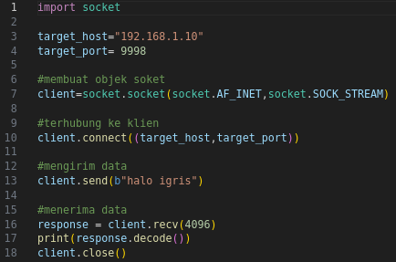
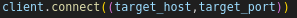

# Client TCP
simple python based TCP client

## Penjelasan : 

Berkali-kali selama uji penetrasi, kami perlu menyiapkan klien TCP untuk menguji layanan, mengirim data sampah, fuzz, atau melakukan sejumlah tugas lainnya. Jika Anda bekerja dalam keterbatasan, tidak akan memiliki kemewahan untuk menggunakan alat jaringan atau kompiler, dan terkadang bahkan akan kehilangan dasar-dasar mutlak, seperti kemampuan untuk menyalin/menempel atau terhubung ke internet. Di sinilah kemampuan untuk membuat klien TCP dengan cepat menjadi sangat berguna.  

Pertama kita membuat objek soket dengan parameter AF_INET dan SOCK_STREAM. 

Parameter AF_INET menunjukkan bahwa kita akan menggunakan alamat IPv4 atau nama host standar, dan SOCK_STREAM menunjukkan bahwa ini akan menjadi klien TCP. Kemudian kita menghubungkan klien ke server  

dan mengirimkannya beberapa data sebagai byte 3. Langkah terakhir adalah menerima kembali beberapa data dan mencetak respons 4 lalu menutup soket. Ini adalah bentuk klien TCP yang paling sederhana, tetapi ini adalah yang paling sering Anda tulis.

Potongan kode ini membuat beberapa asumsi serius tentang soket yang pasti ingin Anda ketahui. Asumsi pertama adalah bahwa koneksi kita akan selalu berhasil, dan yang kedua adalah bahwa server mengharapkan kita untuk mengirim data terlebih dahulu (beberapa server berharap untuk mengirim data kepada Anda terlebih dahulu dan menunggu respons Anda). Asumsi ketiga kita adalah bahwa server akan selalu mengembalikan data kepada kita tepat waktu. Kita membuat asumsi ini sebagian besar demi kesederhanaan. Sementara programmer memiliki pendapat yang beragam tentang cara menangani soket yang diblokir, penanganan pengecualian dalam soket, dan sejenisnya, sangat jarang bagi pentester untuk membangun hal-hal baik ini ke dalam alat cepat dan mudah mereka untuk pekerjaan pengintaian atau eksploitasi, jadi kami akan menghilangkannya dalam bab ini.